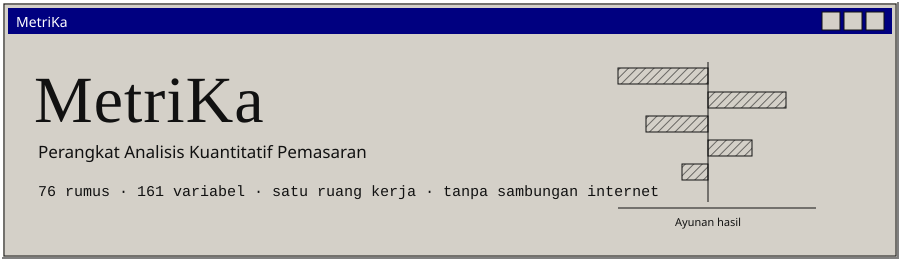

<!-- markdownlint-disable first-line-h1 -->
<!-- markdownlint-disable html -->

<p align="center">
  
</p>

<hr>

<div align="center" style="line-height: 1;">
  <a href="https://samuelhtampubolon.github.io/MetrikaX/" target="_blank">
    
  </a>
  <a href="https://github.com/samuelhtampubolon/MetrikaX/releases/latest/download/MetriKa-portable-windows-x64.exe">
    
  </a>
  <a href="https://samuelhtampubolon.github.io/MetrikaX/metrika-offline.html" target="_blank">
    
  </a>
</div>

<div align="center" style="line-height: 1;">
  <a href="https://github.com/samuelhtampubolon/MetrikaX/actions/workflows/ci.yml">
    
  </a>
  <a href="https://github.com/samuelhtampubolon/MetrikaX/releases">
    
  </a>
  <a href="#9-lisensi">
    
  </a>
  <a href="spec/metrika.spec.json">
    
  </a>
</div>

<p align="center">
  <b><a href="https://samuelhtampubolon.github.io/MetrikaX/">Buka aplikasi</a></b>
  &nbsp;&nbsp;|&nbsp;&nbsp;
  <b><a href="https://github.com/samuelhtampubolon/MetrikaX/releases/latest/download/MetriKa-portable-windows-x64.exe">Unduh berkas jalankan</a></b>
  &nbsp;&nbsp;|&nbsp;&nbsp;
  <b><a href="DEVIATIONS.md">Catatan penyimpangan</a></b>
  &nbsp;&nbsp;|&nbsp;&nbsp;
  <b><a href="spec/metrika.spec.json">Spesifikasi</a></b>
</p>

## Daftar isi

1. [Pengantar](#1-pengantar)
2. [Ringkasan](#2-ringkasan)
3. [Unduh dan jalankan](#3-unduh-dan-jalankan)
4. [Angka terukur](#4-angka-terukur)
5. [Menjalankan dari sumber](#5-menjalankan-dari-sumber)
6. [Arsitektur](#6-arsitektur)
7. [Luring dan keamanan](#7-luring-dan-keamanan)
8. [Yang belum terpenuhi](#8-yang-belum-terpenuhi)
9. [Lisensi](#9-lisensi)
10. [Rujukan](#10-rujukan)

## 1. Pengantar

MetriKa menghitung 76 rumus pemasaran kuantitatif dari angka yang dimasukkan pengguna.

Mesinnya bukan kalkulator melainkan graf kendala. Setiap rumus dapat diselesaikan ke arah maju
maupun mundur, sehingga nilai yang tidak dimasukkan tetap diturunkan selama masukannya cukup.
Masukkan pendapatan dan jumlah pesanan, lalu nilai pesanan rata rata muncul dengan sendirinya,
lengkap dengan jejak penurunannya.

Tiga sifat menentukan rancangannya:

- **Menolak, bukan menebak.** Bila masukan tidak cukup atau berada di luar domain, perangkat ini
  menyatakan apa yang kurang dan apa yang perlu dilakukan, bukan menampilkan angka yang kelihatan
  masuk akal.
- **Luring sebagai keadaan baku.** Tidak ada permintaan jaringan sama sekali, dan hal itu diukur
  oleh uji pada peramban sungguhan, bukan dijanjikan pada dokumen.
- **Milik perangkat pengguna.** Seluruh data tersimpan pada mesin pengguna: IndexedDB pada web,
  SQLite di samping berkas jalankan pada desktop.

## 2. Ringkasan

| Bagian                | Isi                                                                        |
| --------------------- | -------------------------------------------------------------------------- |
| Rumus                 | 76, seluruhnya dibangkitkan dari satu sumber kebenaran                     |
| Variabel kanonik      | 161, ditambah 57 variabel hasil yang dibangkitkan codegen                  |
| Penyelesaian balik    | Setiap rumus yang dapat diisolasi, maju dan mundur                         |
| Analisis sensitivitas | Pergeseran satu per satu 10 persen untuk kelas struktur C4, C5, C6, C7, C9 |
| Grafik                | Garis, langkah, batang, tornado, kurva kumulatif, sebar, hitam putih       |
| Pembangkit soal       | Tujuh jenis, tiap soal dapat dibangkitkan ulang dari benihnya              |
| Bahasa antarmuka      | Indonesia dan Inggris, 1199 kunci teks                                     |
| Penyimpanan           | IndexedDB pada web, SQLite pada desktop, memori bila keduanya ditolak      |
| Uji                   | 693 uji satuan dan 16 uji ujung ke ujung pada peramban sungguhan           |

Rancangan tampilannya mengacu pada G\*Power 3.1: bevel Win32, kerapatan tinggi, tanpa animasi,
tanpa warna aksen. Yang dicari adalah tampilan sebuah instrumen, bukan sebuah produk.

## 3. Unduh dan jalankan

| Cara                         | Tautan                                                                                                                                      | Untuk siapa                                                                  |
| ---------------------------- | ------------------------------------------------------------------------------------------------------------------------------------------- | ---------------------------------------------------------------------------- |
| **Aplikasi web**             | [samuelhtampubolon.github.io/MetrikaX](https://samuelhtampubolon.github.io/MetrikaX/)                                                       | Pemakaian biasa. Berfungsi luring setelah satu kali kunjungan                |
| **Windows, portabel**        | [MetriKa-portable-windows-x64.exe](https://github.com/samuelhtampubolon/MetrikaX/releases/latest/download/MetriKa-portable-windows-x64.exe) | Tanpa pemasangan dan tanpa hak administrator. Salin ke flash drive, jalankan |
| **Windows, dengan pemasang** | [Halaman rilis](https://github.com/samuelhtampubolon/MetrikaX/releases/latest)                                                              | Pemasangan biasa untuk satu pengguna                                         |
| **Berkas tunggal luring**    | [metrika-offline.html](https://samuelhtampubolon.github.io/MetrikaX/metrika-offline.html)                                                   | Mesin yang melarang pemasangan dan tidak memiliki peladen. Klik ganda        |
| **Linux dan macOS**          | [Halaman rilis](https://github.com/samuelhtampubolon/MetrikaX/releases/latest)                                                              | AppImage dan dmg                                                             |

Bangunan web biasa tidak dapat dibuka langsung dari cakram: peramban menolak memuat skrip modul
melalui `file://`. Berkas tunggal dibuat justru untuk keadaan itu, dengan skrip dan gaya disisipkan
di dalamnya. Lihat [`DEVIATIONS.md`](DEVIATIONS.md), D-21.

## 4. Angka terukur

Nilai berikut diisi dengan hasil pengukuran, bukan dengan perkiraan. Baris yang belum diukur
dinyatakan sebagai belum diukur, bukan dikosongkan.

| Ukuran                          | Ambang spesifikasi | Terukur                           |
| ------------------------------- | ------------------ | --------------------------------- |
| Jumlah rumus dalam registri     | tepat 76           | 76                                |
| Jumlah variabel kanonik         | minimal 150        | 161                               |
| Kasus uji emas                  | minimal 304        | 376                               |
| Jangkauan propagasi AC-04       | minimal 12         | 4, belum terpenuhi                |
| Kunci katalog teks              | dua bahasa penuh   | 1199, 801 tanpa nilai Inggris     |
| Permintaan ke asal lain         | nol                | nol, diukur di Chromium           |
| Nasihat keamanan kebergantungan | nol                | nol                               |
| Bundel web JavaScript           | belum ditetapkan   | 679 KB, 153 KB setelah gzip       |
| Bundel web CSS                  | belum ditetapkan   | 15 KB                             |
| Berkas tunggal luring           | belum ditetapkan   | 703 KB                            |
| Berkas portabel Windows         | di bawah 30 MB     | 4,48 MB                           |
| Bangunan desktop tiga sistem    | berhasil           | berhasil, ketiganya               |
| Waktu mulai dingin              | di bawah 2 detik   | belum diukur, perlu mesin Windows |

## 5. Menjalankan dari sumber

```sh
pnpm install
pnpm codegen      # membaca spec, menulis sumber terbangkit
pnpm verify       # memeriksa bahwa sumber terbangkit sama dengan hasil pembangkitan segar
pnpm typecheck
pnpm test
pnpm lint
pnpm build        # membangun aplikasi web ke docs/
pnpm --filter @metrika/app run dev                # galeri komponen ada pada #gallery
pnpm --filter @metrika/app exec playwright test   # uji luring dan keamanan
pnpm audit --audit-level low
```

Membangun cangkang desktop memerlukan Rust beserta kebergantungan webview pada sistem yang dipakai.

## 6. Arsitektur

| Jalur              | Isi                                                      |
| ------------------ | -------------------------------------------------------- |
| `spec/`            | Sumber kebenaran tunggal: `metrika.spec.json`            |
| `packages/codegen` | Pembaca spesifikasi yang memancarkan sumber TypeScript   |
| `packages/engine`  | Mesin perhitungan murni, tanpa impor antarmuka           |
| `packages/ui`      | Kit widget lawas: bevel, kendali, grafik, chrome jendela |
| `packages/app`     | Aplikasi: ragam bahasa, keadaan, penyimpanan, dan layar  |
| `packages/desktop` | Cangkang Tauri: jendela, izin, dan penyimpanan portabel  |

Seluruh berkas di bawah `src/**/generated/` dan `test/golden/` dihasilkan oleh codegen. Berkas
tersebut tidak boleh disunting dengan tangan. Bila sebuah rumus keliru, perbaiki
`spec/metrika.spec.json` lalu jalankan codegen ulang. CI menegakkan hal itu: berkas terbangkit
dibuat ulang lalu dibandingkan, dan selisih apa pun menggagalkan pembangunan.

Empat keputusan rancangan menentukan sisanya:

- **ADR-002.** Mesin tidak mengimpor React, DOM, maupun Node. Aturan lint menegakkannya.
- **ADR-003.** Ekspresi dikompilasi pada saat pembangkitan. Tidak ada `eval` dan tidak ada
  konstruktor `Function` pada aplikasi yang dikirimkan.
- **ADR-004.** Satu antarmuka penyimpanan, tiga penyesuainya: SQLite, IndexedDB, memori.
- **ADR-006.** Tidak ada satu pun teks yang terlihat pengguna ditulis langsung di dalam komponen.

## 7. Luring dan keamanan

Perangkat ini tidak melakukan permintaan jaringan apa pun, dan hal itu diukur, bukan dijanjikan.
Berkas `packages/app/e2e/offline.spec.ts` menjalankan bangunan produksi di dalam peramban
sungguhan, mencatat setiap permintaan yang dikeluarkan halaman, lalu menegaskan bahwa jumlah
permintaan ke asal lain adalah nol. Uji lain memuat halaman satu kali, mematikan jaringan, memuat
ulang, dan menghitung dua rumus beserta penurunannya.

| Langkah                                                      | Tempat                                    |
| ------------------------------------------------------------ | ----------------------------------------- |
| `connect-src 'none'` pada desktop, `'self'` pada web         | `tauri.conf.json`, `index.html`           |
| Tidak ada plugin http, tidak ada pembaru otomatis            | `Cargo.toml`, `capabilities/default.json` |
| Tidak ada `eval` dan tidak ada konstruktor `Function`        | aturan lint, dan uji pada peramban        |
| Tidak ada `fetch` dan `XMLHttpRequest` pada sumber antarmuka | aturan lint                               |
| Service worker menolak permintaan lintas asal                | `public/sw.js`                            |
| Pemeriksaan nasihat kebergantungan                           | `pnpm audit` pada CI                      |
| Seluruh data tersimpan pada perangkat pengguna               | IndexedDB pada web, SQLite pada desktop   |

## 8. Yang belum terpenuhi

Daftar ini ada karena perkakas yang menolak menebak juga tidak pantas menebak tentang dirinya
sendiri. Rinciannya ada pada [`DEVIATIONS.md`](DEVIATIONS.md).

| Butir                      | Keadaan                                                                                                      |
| -------------------------- | ------------------------------------------------------------------------------------------------------------ |
| AC-04, jangkauan propagasi | Terukur 4, disyaratkan 12. Sebabnya korpus, bukan mesinnya. D-11                                             |
| AC-16, dua bahasa penuh    | 801 dari 1199 kunci masih memuat teks Indonesia pada katalog Inggris. D-13                                   |
| Berkas jalankan Windows    | Terbangun dan terukur 4,48 MB, tetapi belum pernah dijalankan seorang pun pada mesin Windows sungguhan. D-18 |
| Waktu mulai dingin         | Belum diukur, perlu mesin Windows                                                                            |
| Fase yang belum dikerjakan | P16 sampai P21: Pelajari, Latihan, Kemajuan, dan Misi                                                        |

## 9. Lisensi

MIT. Lihat [`LICENSE`](LICENSE).

Hasil yang dihasilkan perangkat ini diproduksi secara lokal oleh perangkat itu sendiri dan tidak
diverifikasi oleh lembaga mana pun.

## 10. Rujukan

- [Spesifikasi](spec/metrika.spec.json) dan [riwayat perubahannya](spec/CHANGELOG-spec.md)
- [Catatan penyimpangan dan keputusan yang perlu ditinjau](DEVIATIONS.md)
- [Alur kerja CI](.github/workflows/ci.yml), [Pages](.github/workflows/pages.yml),
  [Rilis](.github/workflows/release.yml)
